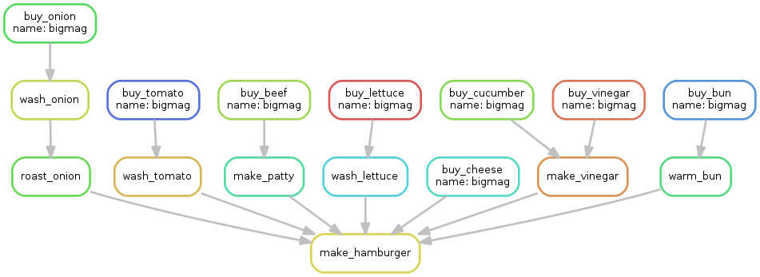

#snakemake-hamburger

This is a beginner's tutorial to **modular** Snakemake, which is inspired by [SandwichesWithSnakemake](https://github.com/leipzig/SandwichesWithSnakemake) tutorial by [Jeremy Leipzig](https://github.com/leipzig). 

## Introduction

Estabilshing a pipeline for your research gives you tremendous advantages in terms of reusability and reproducibility. Especially in the field of bioinformatics, you may find that it is too painful and time-consuming to rewrite rules for tools each time you start a new project. You don't want to waste your time studying user's manual again and again! For this reason, snakemake already have a precious [snakemake-wrappers](http://snakemake-wrappers.readthedocs.io/en/stable/) project which contains basic rules for some routinely-used bioinformatics tools such as Bowtie 2, FastQC, or samtools.

Researchers/research labs usually have their own preferences to the tools, however, snakemake-wrappers repository cannot cover all of the bioinformatics tools because there are numerous tools out there. Therefore it will be great to know how to write your own snakemake module for your own tools. This repository, **snakemake-hamburger**, shows how to write your custom snakemake modules. It assumes your basic knowledge of snakemake. If you are new to snakemake stuffs, please read through the great [SandwichesWithSnakemake](https://github.com/leipzig/SandwichesWithSnakemake) tutorial.

## Making hamburgers

Running bioinformatics pipeline is just like making hamburgers. You prepare raw ingredients(i.e. raw microarray data, raw sequencing data, ...), cook them(i.e. quality control, read mapping, ...), and finally combine them to make awesome results(i.e. finding differentially expressed genes, discovering novel isoforms, ...). So if you can make hamburgers with snakemake, you can write bioinformatics pipeline.

We are going to call each fine-grained step in making hamburgers like buying, washing, cooking ingredients as **wrappers**. Moreover, we aim to make the wrappers as **reusable**, and as **accessible** as possible.

###Use wrappers!

Reusability in snakemake can be maintained by various means: [sub-workflows](https://snakemake.readthedocs.io/en/stable/snakefiles/modularization.html#sub-workflows), using [common-workflow-language](https://snakemake.readthedocs.io/en/stable/snakefiles/modularization.html#common-workflow-language-cwl-support), and using [wrappers](https://snakemake.readthedocs.io/en/stable/snakefiles/modularization.html#wrappers). Here we focus on writing our own wrappers.

Wrappers are basically python scripts which direct the execution of a single step of a workflow. In our example, each wrapper will be located at the end of well-defined directory structure. For example, a wrapper directing a step buying cucumber will be stored at `cucumber/buy/wrapper.py`. You might notice that this directory structure naturally describes the general usage of many bioinformatics tools. For example, a wrapper for `samtools sort` command will be placed at `samtools/sort/wrapper.py`. 

Wrapper scripts are written like below:

```python
__author__ = "Dohoon Lee"
__copyright__ = "Copyright 2018, Dohoon Lee"
__email__ = "dohlee.bioinfo@gmail.com"
__license__ = "MIT"


from os import path

from snakemake.shell import shell

# Extract arguments.
extra = snakemake.params.get('extra', '')

# Execute shell command.
shell("echo '__p_ic_kle___' > {snakemake.output[0]}")
```

The `snakemake.shell` function requires shell commands for an argument. In the shell command, names of output files from snakemake rule will be stored in `snakemake.output` list if you have given those names as non-keyword arguments. Therefore the chunk `{snakemake.output[0]}` inside the command will be substituted with an output value defined in the snakemake rule. In the case you use keyword arguments in snakemake rules, you can access those variables in the wrapper like `{snakemake.input.dirty_lettuce}`. For example, you can write a shell command with keyword argument as below:

```shell
# Excerpt from lettuce/wash/wrapper.py
shell("cat {snakemake.input.dirty_lettuce} | tr -d '*' > {snakemake.output[0]}"
```

After you finish writing wrappers, you have to write snakemake rules which use those wrappers. Just specify input files, output files, additional parameters, and write path to your wrapper under the `script` directive.

```python
# Excerpt from Snakefile
rule buy_tomato:
	output:
		temp('{name}.dirty_tomato')
	script:
		'tomato/buy/wrapper.py'
```

So simple, isn't it? You can even write remote file path starting with `http://` or `https://` in the `script` directive. Even in this case, snakemake will automatically fetch remote scripts from the web, store them temporarily, and execute the workflow as usual. Write your wrappers just once, put the wrappers in some accessible place in the web(github will be a good choice, though here I use DigitalOcean-Spaces), and enjoy the reusability!

```python
# Excerpt from Snakefile_remote
rule buy_tomato:
	output:
		temp('{name}.dirty_tomato')
	script:
		'https://sgp1.digitaloceanspaces.com/dohlee-bioinfo/pipeline/misc/tomato/buy/wrapper.py'
```

### Pipeline explanation

This pipeline finally makes a `.hamburger` file. The name of a hamburger will be your choice. In this example, assume we want `bigmac.hamburger` file through the pipeline. Since the name of a hamburger is specified as a wildcard `{name}` in `Snakefile`, `bigmac` will be assigned to `{name}` throughout the workflow. 

```python
# Excerpt from Snakefile
rule all:
    input:
        '{name}.hamburger'

rule make_hamburger:
    input:
        warm_bun='{name}.warm_bun',
        pickle='{name}.pickle',
        roasted_onion='{name}.roasted_onion',
        cheese='{name}.cheese',
        tomato='{name}.tomato',
        patty='{name}.patty',
        lettuce='{name}.lettuce'
    output:
        '{name}.hamburger'
    script:
        'hamburger/make/wrapper.py'
```

Rule `all` is commonly used to define the ultimate goal of a workflow. In our case, since the rule requires `bigmac.hamburger` file as input, snakemake seeks for a rule which emits `bigmac.hamburger` as its output. If there's an unambiguous match(`make_hamburger` in this case), snakemake then recursively seeks for rules to generate its input file again.

I will not explain how all of the ingredients are generated, but it might be enjoying to look at my codes to see how I imitated the whole process of preparing ingredients.

### Running pipeline

You can run the pipeline as below:

```shell
snakemake bigmac.hamburger -pT
```

I personally prefer specifying `-pT` options when running snakemake pipeline. `-p` option prints shell commands that will be executed, and `-T` adds a timestamp to all logging output.

Running pipeline automatically prepares all the ingredients and makes a nice hamburger!

```shell
$ cat bigmac.hamburger
      warm_bun
       pickle
   roasted_onion
       tomato
       cheese
       patty
       letuce
      warm_bun
```

Note that the remote version of pipeline can be executed as below:

```shell
snakemake -s Snakefile_remote bigmac.hamburger -pT
```

Of course, fetching wrapper files take some time, but it will not be annoying at all. 

### Visualizing pipelines

You can visualize your pipeline by running snakemake with `--dag` option and piping the result through `dot` command. (This requires `graphviz` installed.)

```shell
snakemake --dag bigmag.hamburger | dot -Tpng > img/workflow.png
```



